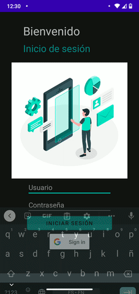
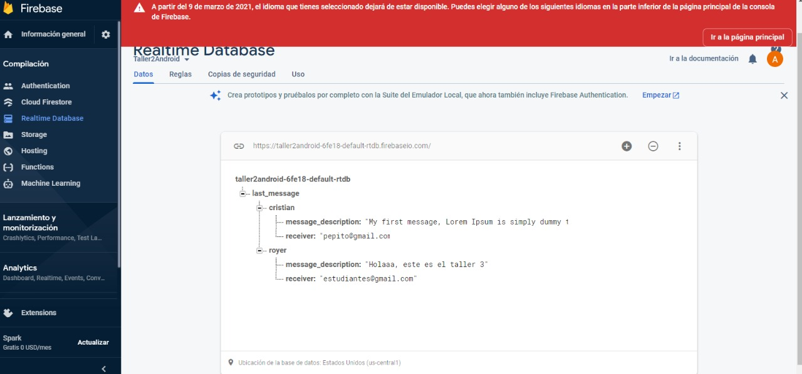
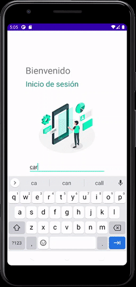
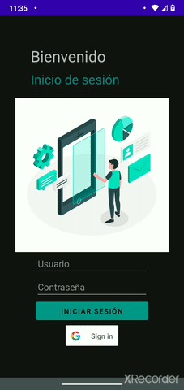

## Taller 3 Android

### Integrantes del grupo
- Luz Carime Lucumí Hernández (@lclucumi)
- Javier Alexis Orozco Manzano (@AlexisOrozcoM)
- Luis Eduardo Albarán Vélez (@luisalvaran17)

### Conexión de App a instancia propia de Firebase

### Incorporación de publicidad en la App con ID de pruebas

### Consulta en API y registros

